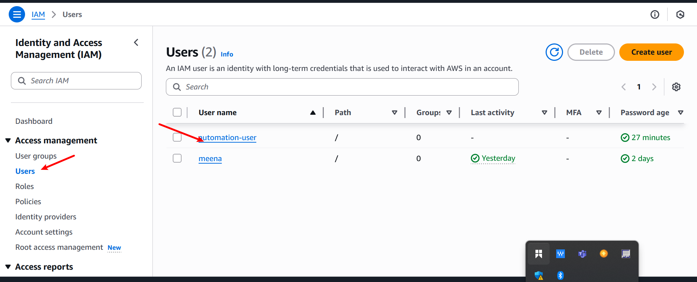
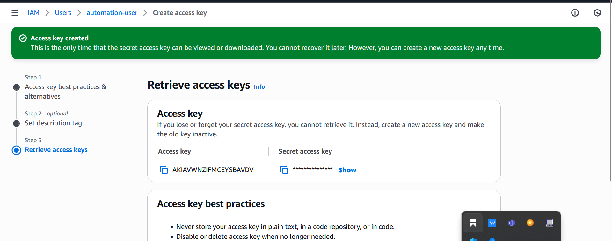

# Setting_Up_Secure_Authentication_AWS_API 

# Step 1 — Create IAM Role
1. In AWS Console, go to IAM → Roles → Create role.

2. Trusted entity type: Select AWS service.

3. Use case: Choose EC2 (since your script will interact with AWS services).
.

4. Click Next and skip attaching permissions for now (we’ll attach later).

5. Name it and Click Create role.

# Step 2 — Create IAM Policy
1. Go to IAM → Policies → Create policy.

2. Choose visual.
.

3. select all resources and click next.

4. Name the policy and click create policy.

# Step 3 — Create IAM User
1. Go to IAM → Users → Create user.

2. User name: automatation user.

3. Access type: Check Programmatic access (for AWS CLI). Click Create user.

# Step 4 — Assign User to IAM Role
1. Go to IAM → Users → Click automation_user.

2. Click Add permissions.

3. Select Attach policies directly.

4. Search for my-project-policy (the same one the role has).

5. Check the box, click Next, then Add permissions.

Now the user and the role both have the same access.

# Attach the IAM Policy to the User
1. Go to Users → automation_user.

2. Permissions → Add permissions → Attach policies directly.
.

3. Select EC2_S3_FullAccess_Policy and Save.

#  Create Programmatic Access Credentials
1. Go to Users → automation_user.
.

2. Security credentials → Create access key.

3. Choose Command Line Interface (CLI) as the use case.
.

4. Copy:
Access Key ID
Secret Access Key (only shown once — store it securely).
.

# Configure AWS CLI on Linux
1. on your terminal, enter aws configure.

2. enter your credential 
.

3. verify if aws is configured.
.